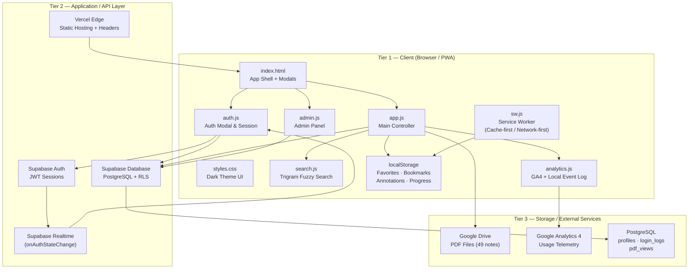
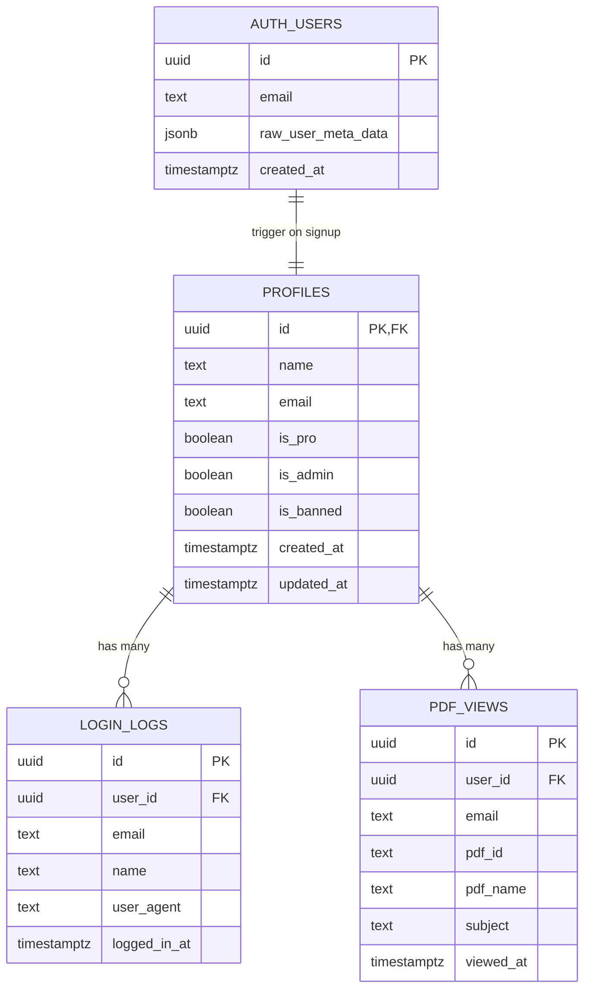
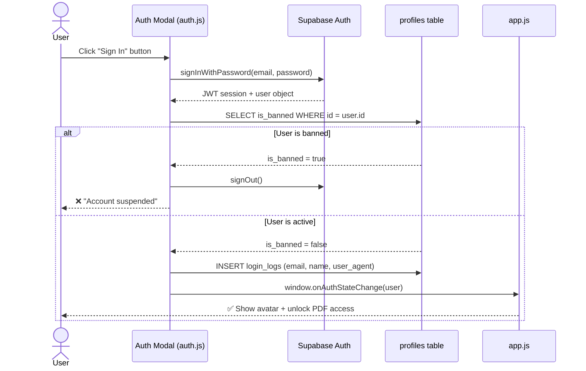
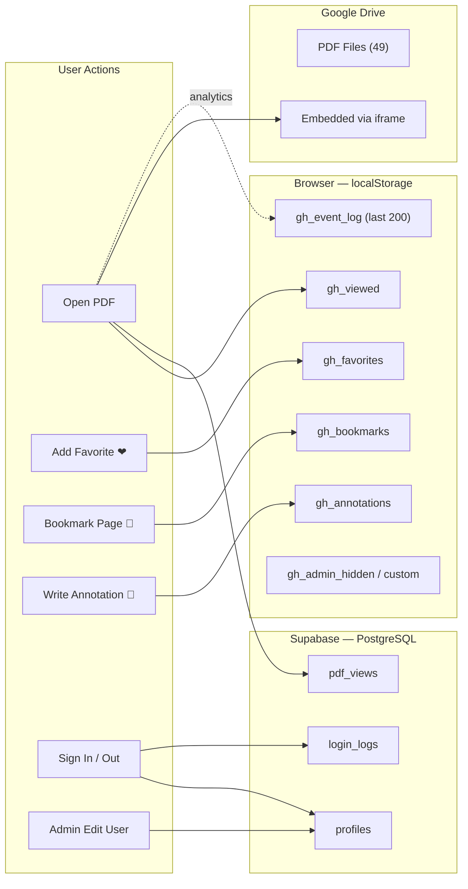
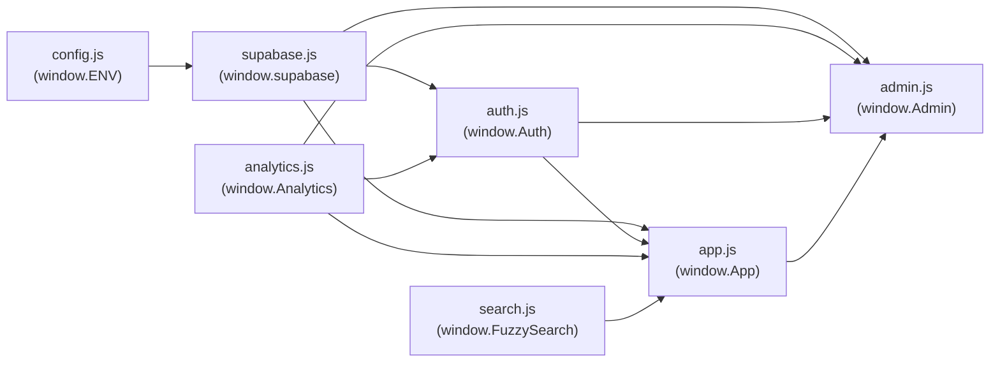
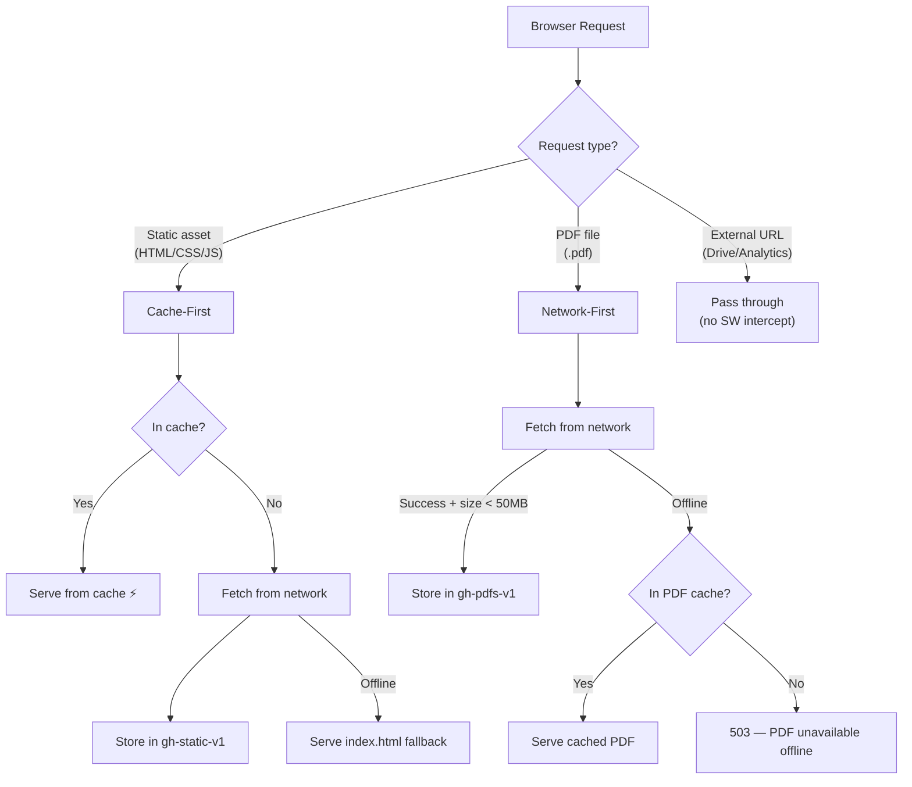
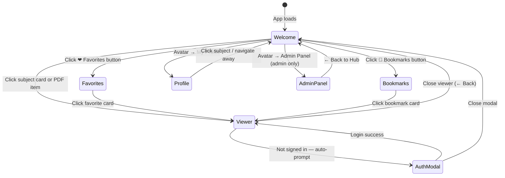
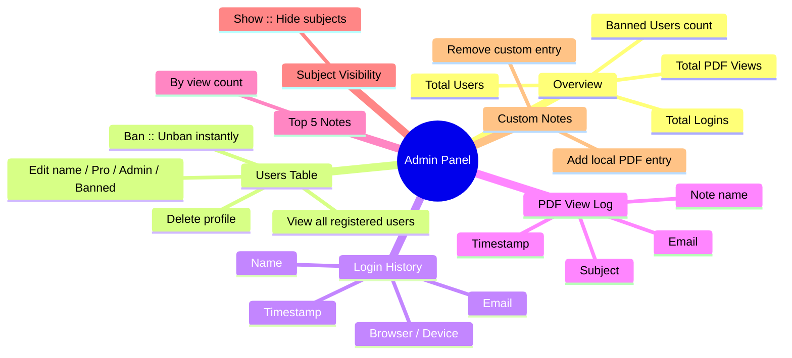
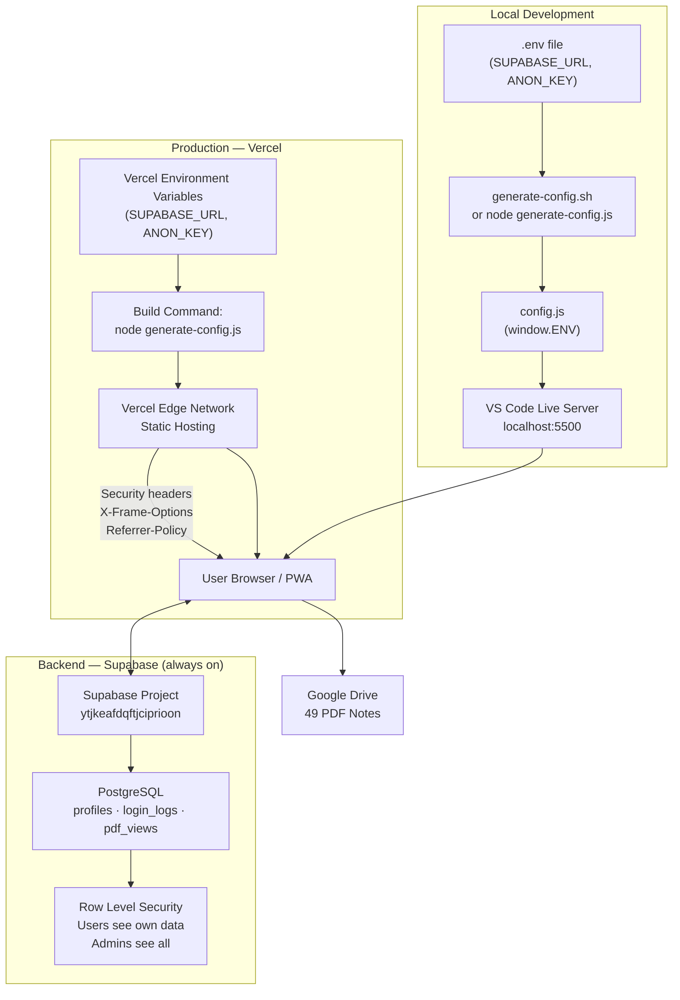

# 📚 GATE Prep Hub

A **Progressive Web App (PWA)** for GATE CS exam preparation — 49 subject-wise PDF notes with authentication, bookmarks, annotations, progress tracking, and a full admin panel.

---

## 3-Tier Application Architecture



---

## File Structure

```
gate prep book/
├── index.html          — App shell, all screens & modals
├── styles.css          — Complete dark-theme CSS
├── app.js              — Main controller (subjects, PDF viewer, screens)
├── auth.js             — Authentication (sign-in, sign-up, session, ban check)
├── admin.js            — Admin panel (user management, logs, visibility)
├── search.js           — Trigram fuzzy search engine
├── analytics.js        — GA4 wrapper + local event log
├── supabase.js         — Supabase client singleton
├── sw.js               — Service Worker (offline PWA support)
├── config.js           — Auto-generated env vars (do not commit)
├── generate-config.js  — Generates config.js from .env (Node.js)
├── generate-config.sh  — Same for Mac/Linux shell
├── schema.sql          — Full Supabase database schema
├── manifest.json       — PWA manifest (icons, shortcuts, display)
├── vercel.json         — Vercel deployment config (headers, build)
├── upload-pdfs.js      — Utility: bulk upload PDFs to storage
└── gate book - Copy/   — Local PDF files (12 subject folders, 49 files)
```

---

## Database Schema



---

## Authentication Flow



---

## Data Flow — Where Data Lives



---

## Module Dependency Map



> **Load order in index.html:** `config.js` → `supabase CDN` → `supabase.js` → `analytics.js` → `search.js` → `auth.js` → `admin.js` → `app.js`

---

## Service Worker Caching Strategy



---

## Screen & Navigation Map



---

## Admin Panel Capabilities



---

## Deployment Architecture



---

## Tech Stack

| Layer | Technology |
|---|---|
| **Frontend** | Vanilla JS (ES2020), HTML5, CSS3 — zero frameworks |
| **Auth** | Supabase Auth v2 (email + password, JWT sessions) |
| **Database** | Supabase PostgreSQL with Row Level Security |
| **PDF Storage** | Google Drive (embedded via iframe, download via export URL) |
| **Search** | Custom trigram fuzzy search (Jaccard similarity) |
| **Analytics** | Google Analytics 4 + localStorage event log |
| **Offline** | Service Worker PWA (Cache-first static, Network-first PDFs) |
| **Deployment** | Vercel (static, edge headers, build command) |
| **Styling** | CSS custom properties, dark theme, responsive grid |

---

## Subjects Covered (12 subjects, 49 notes)

| # | Subject | Notes |
|---|---|---|
| 1 | C & Data Structures | 5 |
| 2 | Algorithms | 4 |
| 3 | Theory of Computation | 5 |
| 4 | Compiler Design | 4 |
| 5 | Operating Systems | 5 |
| 6 | DBMS | 4 |
| 7 | Computer Organization & Architecture | 6 |
| 8 | Digital Logic | 6 |
| 9 | Computer Networks | 4 |
| 10 | Discrete Mathematics | 4 |
| 11 | Engineering Mathematics | 2 |
| 12 | General Ability | 5 |

---

## Local Setup

```bash
# 1. Clone / open the project folder

# 2. Create .env file
echo "SUPABASE_URL=https://your-project.supabase.co" >> .env
echo "SUPABASE_ANON_KEY=your-anon-key" >> .env

# 3. Generate config.js
node generate-config.js
# or on Mac/Linux:
./generate-config.sh

# 4. Serve with Live Server (VS Code extension) or any static server
npx serve .
```

---

## Supabase Setup

Run [schema.sql](schema.sql) in **Supabase Dashboard → SQL Editor**, then grant admin:

```sql
-- Sync existing users into profiles
insert into public.profiles (id, name, email, is_pro, is_admin)
select id, raw_user_meta_data->>'name', email, false, false
from auth.users
on conflict (id) do nothing;

-- Grant admin access
update public.profiles set is_admin = true
where id = (select id from auth.users where lower(email) = 'your@email.com');

update auth.users
set raw_user_meta_data = raw_user_meta_data || '{"is_admin":true}'::jsonb
where lower(email) = 'your@email.com';
```

Sign out and sign in again — the **🔧 Admin Panel** button will appear in the avatar dropdown.
